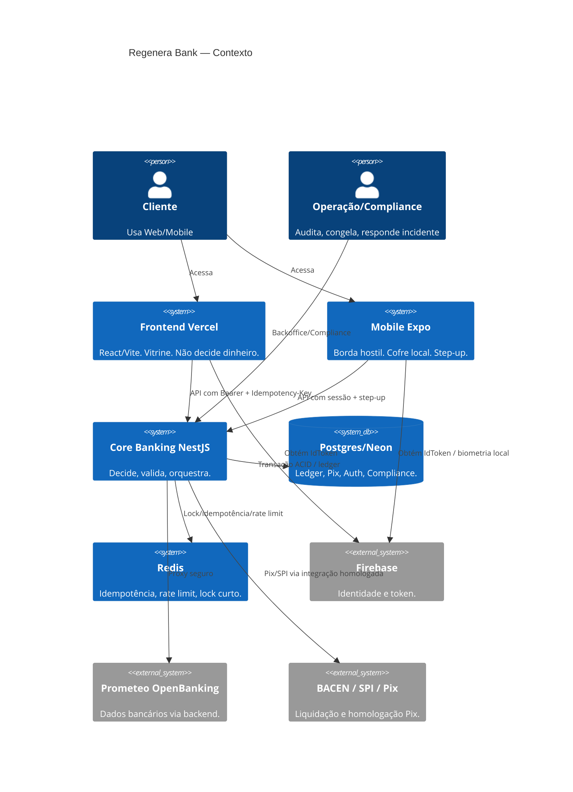
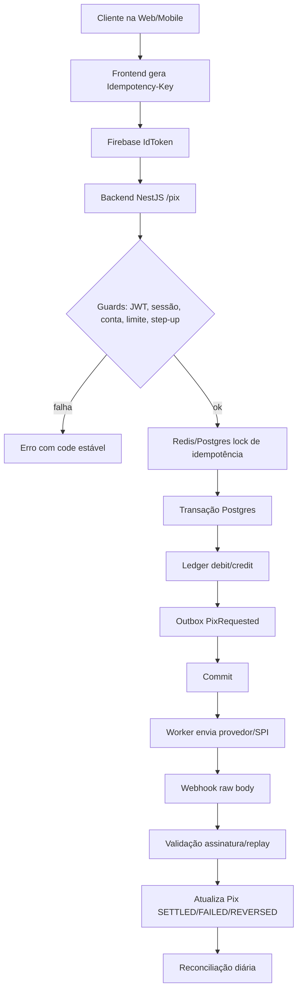
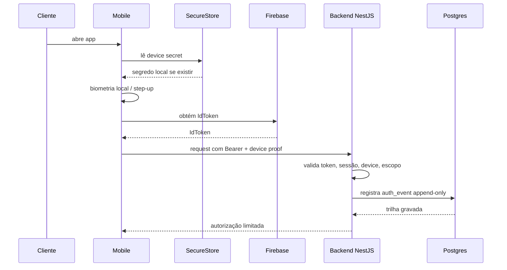

# ARCHITECTURE_BIBLE.md — REGENERA BANK

> Documento de referência institucional.  
> Parte 1 está homologada.  
> Parte 2 funciona no Vercel e pipeline verde no GitHub.  
> Esta Bíblia existe para elevar a Parte 2 ao mesmo nível da Parte 1.

Não é documento de venda.
Não é pitch.
Não é enfeite para investidor.

É mapa de cofre.

## 0. Verdade operacional atual

| Bloco | Estado | Decisão |
|---|---|---|
| Parte 1 | homologada e validada | régua de qualidade |
| Parte 2 Backend | funcional, NestJS, Cloud Run, Postgres, Open Finance | refatorar com testes, tom e fronteiras |
| Parte 2 Mobile | funcional, Expo/React Native | endurecer borda, testes e cofre local |
| Parte 2 Frontend | Vercel funcionando | preservar vitrine, refazer interior |
| Parte 2 Infra | manifests e GCP presentes | conectar ao pipeline e evidência |
| Parte 2 Docs | úteis mas dispersos | centralizar e reescrever no tom |
| GitHub Pipeline | verde aprovado | base oficial de entrega |

## 1. Princípios de arquitetura

### 1.1 Dinheiro

Dinheiro não é `number`.
Dinheiro não é estado de tela.
Dinheiro não é cache.

Dinheiro nasce no ledger.
Ledger prova.
Banco trava.
Auditoria reconstrói.

### 1.2 Frontend

Frontend mostra.
Frontend coleta.
Frontend não decide dinheiro.
Frontend não guarda segredo.

Vitrine bonita não fecha banco.

### 1.3 Mobile

Mobile é rua.
Rua tem root, print, malware, rede ruim e sessão velha.

Mobile faz step-up.
Backend decide.
Ledger prova.

### 1.4 Backend

Backend é juiz.
Mas juiz sem ledger vira opinião.

Controller recebe.
Service decide.
Banco garante.
Outbox comunica.
Log prova.

### 1.5 Infra

Pipeline é porteiro.
Secret Manager é cofre.
Vercel é vitrine.
Cloud Run é motor.
Postgres é memória.
Redis é trava curta.

## 2. Visão geral da stack

| Camada | Tecnologia observada | Função | Risco se mal usada |
|---|---|---|---|
| Web | React, Vite, Vercel, Firebase | vitrine empresarial | segredo no bundle, re-render, API solta |
| Mobile | Expo, React Native, Firebase | borda do cliente | token local, promessa sem backend |
| Backend | NestJS, TypeORM, Cloud Run | decisão e orquestração | controller gordo, rota sem guard, mock vivo |
| Banco | Postgres/Neon | ledger, consent, auth, Pix | migration fraca, N+1, rollback quebrado |
| Cache/lock | Redis | idempotência/rate limit | lock falso, corrida duplicando dinheiro |
| Open Banking | Prometeo via backend | conexão bancária externa | chave no frontend, endpoint sem contrato |
| Observabilidade | Prometheus/Sentry/OpenTelemetry sugeridos | ver o sistema sangrar | painel mentindo, label com dado sensível |
| Infra | GCP, Cloud Run, GKE, Cloud Armor, Argo | operação e segurança | deploy manual, segredo em script |

## 3. Diagrama C4 — Contexto

## 4. Fluxo de dados Pix

## 5. Sequência de autenticação biométrica

Biometria não autoriza dinheiro sozinha.
Biometria destrava intenção.
Backend decide.
Ledger prova.

## 6. Matriz de risco

| Risco | Probabilidade | Impacto | Estado atual | Ação |
|---|---:|---:|---|---|
| Segredo em pacote `.env`/script | Alta | Crítico | detectado em Parte 2/GitHub | remover, rotacionar, Secret Manager |
| Prometeo/API key no frontend | Média | Crítico | frontend tem blindagem/deprecated | bloquear import, teste SAST |
| Pix duplicado por corrida | Média | Crítico | testes existem na Parte 1 | levar para Parte 2 real |
| Ledger sem constraint no banco | Baixa/Média | Crítico | Parte 1 forte | replicar no core aprovado |
| Rota Nest sem guard | Média | Alto | detectado por heurística | marcar pública ou proteger |
| React re-render/fetch loop | Média | Médio | detectado por useEffect | revisar dependências/cache |
| Listener/timer sem cleanup | Média | Médio | detectado | cleanup obrigatório |
| Node_modules versionado | Alta | Médio | detectado em Parte 2 | remover do repo/ZIP |
| Docs dispersos | Alta | Médio | detectado | centralizar em `5. Docs` |
| Deploy manual | Média | Alto | detectado | pipeline único |

## 7. Plano de ação para deploy real

### Fase 0 — preservar o que funciona

- Congelar ZIP GitHub pipeline verde como baseline.
- Exportar envs de Vercel e Cloud Run, sem revelar segredo.
- Rodar smoke test no login Vercel.
- Abrir branch `refactor/parte2-nivel-parte1`.

### Fase 1 — limpar sem quebrar

- Remover `node_modules`, `__MACOSX`, `.DS_Store`.
- Remover `.env` de pacotes.
- Remover deploy manual solto.
- Manter Vercel e pipeline intactos.

### Fase 2 — conectar contrato

- Gerar OpenAPI do NestJS.
- Gerar client com Orval no frontend.
- Mapear endpoints usados pelo frontend.
- Matar endpoint fantasma.
- Garantir Prometeo só via backend.

### Fase 3 — colocar teste onde hoje tem confiança

- Testes de API client.
- Testes de Pix UI com idempotency key estável.
- Testes de auth com Firebase mockado controlado.
- Testes de backend por rota protegida.
- Teste SAST bloqueando segredo.

### Fase 4 — aplicar tom e autoria

- Comentário só explica risco.
- Documento só fica se tiver prova.
- README para de vender e passa a orientar operação.
- Erro vira code estável.
- Vitrine para de prometer o que backend não prova.

### Fase 5 — produção assistida

- Shadow mode.
- Piloto com limite baixo.
- Observabilidade ligada.
- Reconciliação diária.
- Runbook testado.

## 8. Aderência BACEN / PCI-DSS

Este documento não substitui jurídico, compliance nem homologação formal.
Ele organiza controles técnicos para suportar essa conversa.

### Controles mínimos

| Controle | Prova técnica esperada |
|---|---|
| Imutabilidade financeira | trigger/constraint + teste |
| Reconciliação Pix | job diário + relatório |
| Idempotência | chave + lock + replay testado |
| Auditoria | log append-only + correlation id |
| Segredo | Secret Manager/KMS + rotação |
| Dados sensíveis | criptografia/hash/retenção |
| PCI | escopo reduzido, tokenização, segregação |
| LGPD | consentimento, direito do titular, evidência |

## 9. Regra de autoria

Parte 2 não precisa ficar mais bonita.
Precisa ficar mais nossa.

Nosso tom não é decoração.
É método.

Risco.
Consequência.
Prova.
Limite.

Sem isso, o sistema pode até funcionar.
Mas ainda não assina o próprio nome.
