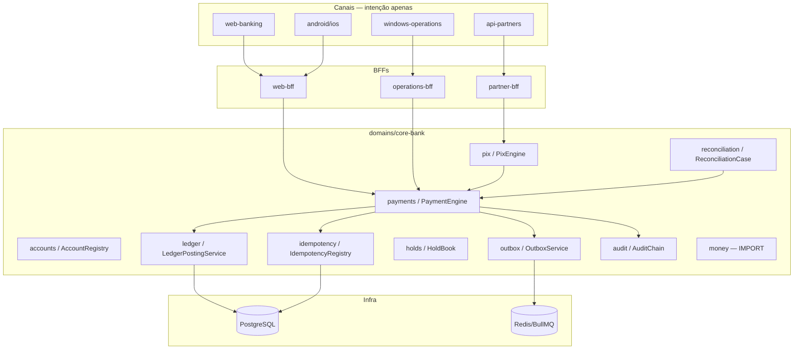
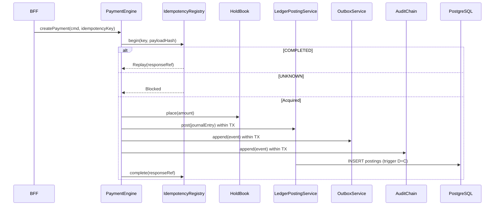
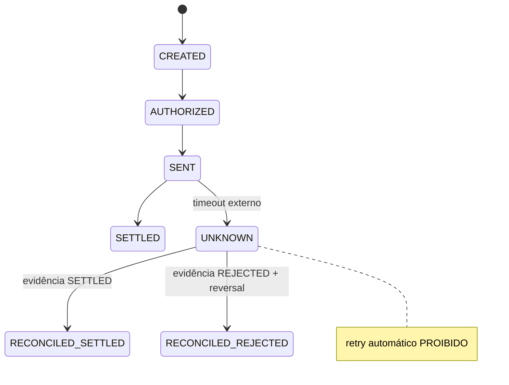

# DESIGN-CORE-BANKING-001 — Núcleo Financeiro Regenera Bank

**Documento:** DESIGN-CORE-BANKING-001  
**Status:** Draft — aprovado para execução Fase 2  
**Data:** 2026-06-29  
**Escopo:** `domains/core-bank/` (NestJS + PostgreSQL + outbox)  
**Autoridade:** Don Paulo Ricardo de Leão  
**Baseline:** commit `7336481c7062266b0bba39b6d43e4bf3c4cd0127` (Kotlin scaffold)  
**Mandato:** `AGENTS.md` (Comando Mestre de Orquestração)

---

## Overview

O Regenera Bank precisa de um **núcleo financeiro executável** que substitua o protótipo HTML (estado em memória) por ledger append-only, idempotência com hash de payload, estado `UNKNOWN` com reconciliação, e saldo derivado exclusivamente de partidas — sem float, sem simulação de liquidação no frontend.

Este design ancora o domínio em `domains/core-bank/`, **importando** `money.value-object.ts` existente (não reescrever), evoluindo o scaffold Kotlin (`JournalEntry`, `LedgerEngine`) para TypeORM + triggers PostgreSQL, e conectando-se aos canais via BFF (sem acesso direto ao ledger).

**Stack:** NestJS 10, TypeScript 5.9+, PostgreSQL 15+, BullMQ (outbox relay), Prometheus.

**Enquadramento Bacen (declarativo, licenças PENDENTE):**
- IP Modalidade Pagamento — Res. BACEN 80/2021
- SCD — Res. BACEN 4.656/2018
- SPI Participante Direto — Manual Pix BACEN / DICT

---

## Background & Motivation

### Estado atual verificado

| Artefato | Situação |
|----------|----------|
| `money.value-object.ts` | **Produzido** — BigInt, `MoneyColumnTransformer`, tom STYLE.pt-BR |
| `05-core-banking/regenera-core-ledger/` Kotlin | Scaffold — `JournalEntry` com D=C em `init` |
| `desing-final-escolhido-geral-index.html` | Protótipo UX — 23 módulos, sem backend |
| `domains/core-bank/` | **Greenfield** — apenas `money.value-object.ts` copiado |
| `regenera-agent.mjs` | Portão byte-a-byte de comentários |
| Produção | **Não** — EXTERNAL-BLOCKERS honestos |

### Dores

1. Protótipo calcula saldo no browser — viola Regra 7 (canal não é domínio)
2. Kotlin baseline não tem triggers SQL nem outbox transacional
3. Idempotência HTTP (Partner APIs) sem unificação com domínio de pagamentos
4. UNKNOWN não modelado — timeout vira retry cego (incidente regulatório)

---

## Goals & Non-Goals

### Goals

- G1: Ledger append-only com triggers PostgreSQL (UPDATE/DELETE → EXCEPTION)
- G2: Partidas duplas D=C enforced ao postar (DRAFT→POSTED)
- G3: `Money` importado — zero float em `domains/core-bank/src/`
- G4: Idempotência `payloadHash = SHA-256(canonical JSON)` — drift → ConflictException
- G5: UNKNOWN bloqueia retry; reconciliação com evidência externa
- G6: Outbox transacional (`publishedAt = null` na criação)
- G7: Audit chain SHA-256 encadeado, `verify()` detecta adulteração
- G8: 47 testes invariantes (T01–T47) verdes antes de PR-15
- G9: EXTERNAL-BLOCKERS e REGULATORY-TRACEABILITY com status honesto

### Non-Goals (v1)

- Homologação SPI/DICT real (PENDENTE — adapters mock em sandbox)
- HSM/KMS institucional (PENDENTE)
- Canais Web/Android/iOS completos (PR-09–PR-13 — design paralelo)
- Kotlin core replacement (baseline permanece referência)

---

## Proposed Design

### Arquitetura de módulos



### Fluxo financeiro principal



### Fronteiras de autoridade (Regra 7)

| Camada | Pode | Não pode |
|--------|------|----------|
| Canal | Capturar intenção, exibir saldo do BFF | Calcular saldo, acessar PG |
| BFF | Compor DTO, correlation ID | Postar ledger, decidir fraude |
| Core | Postar, idempotir, reconciliar | Renderizar UI |

---

## Data Model

### Schema `core_banking`

```sql
-- V001__core_banking_foundation.sql (resumo)

CREATE SCHEMA core_banking;

CREATE TYPE account_class AS ENUM ('ASSET','LIABILITY','EQUITY','REVENUE','EXPENSE');
CREATE TYPE account_status AS ENUM ('OPEN','BLOCKED','CLOSED');
CREATE TYPE posting_side AS ENUM ('DEBIT','CREDIT');
CREATE TYPE journal_status AS ENUM ('DRAFT','POSTED','REVERSED');
CREATE TYPE idempotency_state AS ENUM ('PROCESSING','COMPLETED','UNKNOWN','FAILED_RETRYABLE','FAILED_FINAL');
CREATE TYPE payment_status AS ENUM ('CREATED','AUTHORIZED','SENT','SETTLED','UNKNOWN','FAILED','RECONCILED');

-- amount_minor: BIGINT NOT NULL CHECK (amount_minor > 0)
-- Nunca numeric/float/decimal sem bigint semantics

CREATE TABLE journal_entries (...);
CREATE TABLE ledger_postings (...);
CREATE TABLE idempotency_records (...);
CREATE TABLE payments (...);
CREATE TABLE holds (...);
CREATE TABLE outbox_events (published_at TIMESTAMPTZ NULL); -- null na criação
CREATE TABLE audit_events (previous_hash TEXT NOT NULL, event_hash TEXT NOT NULL);
CREATE TABLE reconciliation_cases (...);
```

### Quatro triggers obrigatórios

| # | Trigger | Comportamento |
|---|---------|---------------|
| T1 | `trg_posting_draft_only` | INSERT posting só em journal DRAFT |
| T2 | `trg_journal_balance_on_post` | DRAFT→POSTED exige sum(D)=sum(C) |
| T3 | `trg_ledger_append_only` | UPDATE/DELETE em journal/postings → RAISE |
| T4 | `trg_audit_append_only` | UPDATE/DELETE em audit_events → RAISE |

### V002 — Views operacionais

- `account_signed_balances` — soma de postings por conta
- `available_balances` — signed − holds ativos
- `unresolved_financial_states` — payments UNKNOWN + reconciliation aberta

---

## Idempotency Contract

```typescript
static payloadHash(payload: object): string {
  const canonical = JSON.stringify(payload, Object.keys(payload).sort());
  return createHash('sha256').update(canonical, 'utf8').digest('hex');
}
```

| Estado | Comportamento |
|--------|---------------|
| COMPLETED | Replay `responseReference` |
| UNKNOWN | **Blocked** — não executa |
| FAILED_RETRYABLE | Acquired — pode retentar |
| PROCESSING | Blocked — em andamento |
| Mesma chave + hash diferente | `ConflictException` |

---

## UNKNOWN & Reconciliation



Runbook: `RUNBOOK-CORE-001-UNKNOWN.md` (produzido em PR-00)

---

## API / Interface Changes (Core HTTP interno)

| Endpoint | Método | Descrição |
|----------|--------|-----------|
| `/v1/internal/payments` | POST | createPayment + Idempotency-Key |
| `/v1/internal/payments/:id/reconcile` | POST | maker-checker — resolve UNKNOWN |
| `/v1/internal/accounts/:id/balance` | GET | projeção do razão |
| `/v1/internal/ledger/entries/:id/verify` | GET | hash chain check |

OpenAPI em `contracts/openapi/core-banking-v1.yaml` (PR-00)

---

## Alternatives Considered

### A1: Estender monólito `pipeline-green-v4` em vez de `domains/core-bank/`

| Prós | Contras |
|------|---------|
| Código NestJS já existe | Mistura task-queue com ledger; viola bounded context |
| **Decisão:** Rejeitado — `domains/core-bank/` greenfield com import de Money |

### A2: Manter Kotlin como motor de ledger

| Prós | Contras |
|------|---------|
| Baseline auditado | Dois runtimes; testes 47 invariantes duplicados |
| **Decisão:** Rejeitado — TypeScript/NestJS autoritativo; Kotlin = referência |

### A3: Saldo em coluna `accounts.balance`

| Prós | Contras |
|------|---------|
| Query rápida | Derivação dupla; drift ledger↔coluna |
| **Decisão:** Rejeitado — saldo = view `account_signed_balances` |

---

## Security & Privacy

- Sigilo bancário LC 105/2001 — logs sem PII completa
- Maker-checker em `reconcile` e operações privilegiadas
- Session guard (PR-05) antes de Pix
- Webhook HMAC (T20–T22) — tolerância de clock

---

## Observability

| Métrica | Labels | Notas |
|---------|--------|-------|
| `core_payment_created_total` | status | sem tenant_id high-cardinality |
| `core_ledger_postings_total` | side | |
| `core_idempotency_unknown_total` | — | alerta P1 se > 5/5min |
| `core_outbox_pending` | — | relay lag |

---

## Rollout Plan

1. **Homolog:** PR-00→PR-08 — core completo + mocks SPI
2. **Staging:** PR-09→PR-14 — canais + DS
3. **Canary:** PR-15 — 1% tráfego, gate `regenera-agent.mjs` + 47 testes

Feature flags: `CORE_PAYMENTS_ENABLED`, `CORE_PIX_LIVE` (default false)

---

## Open Questions (defaults v1)

| # | Questão | Default v1 |
|---|---------|------------|
| Q1 | ISPB para E2E ID | Placeholder homolog `12345678` |
| Q2 | Retenção audit_events | 7 anos PostgreSQL |
| Q3 | Mock SPI vs adapter real | Mock em homolog; EXTERNAL-BLOCKERS PENDENTE |
| Q4 | BullMQ vs Kafka outbox | BullMQ v1 (já no ecossistema) |

---

## Key Decisions

| # | Decisão | Racional |
|---|---------|----------|
| KD-1 | Import `money.value-object.ts` — não reescrever | Arquivo auditado, tom STYLE.pt-BR |
| KD-2 | `domains/core-bank/` greenfield | Bounded context limpo |
| KD-3 | Triggers SQL são domínio | Append-only não é convenção de app |
| KD-4 | Saldo = view sobre postings | Regra 5 + Regra 7 |
| KD-5 | UNKNOWN ≠ FAILED | Regra 4 — reconciliação obrigatória |
| KD-6 | payloadHash canônico JSON | Regra 3 — drift detectado |
| KD-7 | Outbox `publishedAt` null inicial | Idempotência de relay |
| KD-8 | Audit previousHash chain | T28 — adulteração detectável |
| KD-9 | Bacen PENDENTE_LICENCA em docs | Regra 9 — honestidade |
| KD-10 | 47 testes gate de merge | Evidência vinculada ao artefato |
| KD-11 | `regenera-agent.mjs` pós-PR | Regra 6 — sem vestígio IA |
| KD-12 | Canais via BFF apenas | Regra 7 |

---

## EXTERNAL-BLOCKERS.md

Produzido em `domains/core-bank/docs/EXTERNAL-BLOCKERS.md` no PR-00. Status: todos PENDENTE exceto implementação local verificável.

---

## REGULATORY-TRACEABILITY.csv

Ver `domains/core-bank/governance/REGULATORY-TRACEABILITY.csv` — REG-001 a REG-008 conforme AGENTS.md seção 10.

---

## PR Plan

### PR-00: Bootstrap e governança

**Componentes:** `AGENTS.md`, `EXTERNAL-BLOCKERS.md`, CI, `repo-gates.sh`, estrutura `domains/`  
**Dependências:** Nenhuma  
**Descrição:** Pipeline verde; sem segredo em código; ADRs 001–004

---

### PR-01: Money canônico

**Componentes:** `money.value-object.ts` (import), `domain-foundation.spec.ts` T01–T08  
**Dependências:** PR-00  
**Descrição:** Zero float em src/

---

### PR-02: Ledger append-only

**Componentes:** `V001` migrations, `ledger-posting.service.ts`, `ledger-invariants.spec.ts` T25–T32  
**Dependências:** PR-01

---

### PR-03: Idempotência

**Componentes:** `idempotency.service.ts`, testes T33–T37  
**Dependências:** PR-02

---

### PR-04: Máquinas de estado

**Componentes:** `pix.state-machine.ts`, `consent.state-machine.ts`, T09–T18  
**Dependências:** PR-03

---

### PR-05: Identity + Session

**Componentes:** `session-auth.guard.ts`, T41–T42  
**Dependências:** PR-04

---

### PR-06: Accounts

**Componentes:** `account-registry.service.ts`, saldo derivado, T24–T25  
**Dependências:** PR-02, PR-05

---

### PR-07: Pix fundação

**Componentes:** `pix-engine.service.ts`, `FOR UPDATE`, T38–T40  
**Dependências:** PR-03, PR-04, PR-06

---

### PR-08: Integrações externas

**Componentes:** SPI/DICT adapters mock + EXTERNAL-BLOCKERS update  
**Dependências:** PR-07

---

### PR-09: Design tokens

**Componentes:** Extração HTML → `design-system/tokens/`  
**Dependências:** PR-00

---

### PR-10: Componentes DS

**Componentes:** 23 module shells  
**Dependências:** PR-09

---

### PR-11: Web Banking shell

**Componentes:** BFF + rotas + contract tests  
**Dependências:** PR-06, PR-10

---

### PR-12: Android shell

**Dependências:** PR-10

---

### PR-13: iOS shell

**Dependências:** PR-10

---

### PR-14: Windows Operations

**Componentes:** maker-checker, T16–T18  
**Dependências:** PR-05, PR-06

---

### PR-15: Partner API + produção

**Componentes:** OpenAPI, gates finais, `regenera-agent --apply`, PACKAGE-CHECKSUMS  
**Dependências:** PR-08, PR-11–PR-14  
**Gate:** 47 testes verdes + critério seção 12 AGENTS.md

---

## References

- `AGENTS.md`
- `STYLE.pt-BR.md`
- `MAPA_MESTRE_DESENVOLVIMENTO_CANAIS_REGENERA_BANK(1).md`
- `desing-final-escolhido-geral-index.html`
- `05-core-banking/regenera-core-ledger/src/domain/model/JournalEntry.kt`
- `domains/core-bank/src/money/money.value-object.ts`

---

*Assinado: Don Paulo Ricardo de Leão — 2026-06-29*